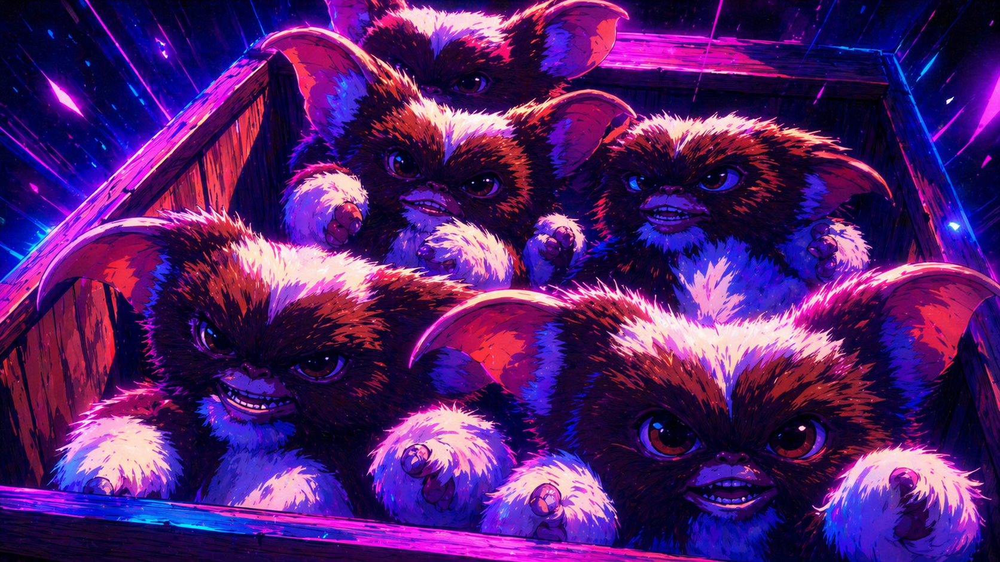

# Gremlins🧌 (`pi-gremlins`)

Pi package. Adds `Gremlins🧌` user-facing tool branding for summoning specialized workers through isolated in-process Pi SDK child sessions, plus primary-agent selection formerly provided by `pi-mohawk`.

Suggested GitHub About text:

> Gremlin-flavored Pi package for isolated in-process SDK child delegation.

## What tool does

`Gremlins🧌` runs one or more gremlins with isolated child-session context. Primary-agent controls select one parent-session agent role and inject its raw markdown into the parent system prompt before each turn.

Current contract:

- one tool/runtime identifier: `pi-gremlins`
- one input shape: `gremlins: [{ intent, agent, context, cwd? }]`
- `intent`, `agent`, and `context` are required non-empty strings
- array length `1..10`
- one gremlin = single run
- multiple gremlins = parallel run
- inline progress only, expand the tool row with `Ctrl+O`

Agent definitions load direct `.md` files from:

- `~/.pi/agent/agents`
- nearest ancestor `.pi/agents` for the effective working directory

Roles stay separated by frontmatter:

- `agent_type: sub-agent` files are gremlins that the `pi-gremlins` tool can summon. They must have a frontmatter `name`; optional `description`, `model`, `thinking`, and `tools` fields can guide the child session. Symlinked markdown is included for gremlin discovery.
- `agent_type: primary` files are parent-session primary agents selected through `/gremlins:primary` or `Ctrl+Shift+M`. Their display names fall back from frontmatter `name`, to first H1, to filename stem. Symlinked markdown is ignored for primary-agent discovery.
- untyped files and other agent types are ignored.

Gremlin example:

```yaml
---
name: researcher
description: Research-focused gremlin
agent_type: sub-agent
---
```

Primary-agent example:

```yaml
---
name: Orchestrator
description: Parent-session role
agent_type: primary
---
```

If user and nearest-project directories define the same display name for the same role, the project definition wins. Names are sorted for display/cycling after role filtering and precedence merge.

Important: UI label may show `Gremlins🧌` for human-facing branding. Actual package/runtime/tool identifier stays `pi-gremlins` for install and invocation wiring.

## Install

From local checkout:

```bash
pi install /absolute/path/to/pi-gremlins
```

From GitHub:

```bash
pi install git:github.com/magimetal/pi-gremlins
# or
pi install https://github.com/magimetal/pi-gremlins
```

Project-local install:

```bash
pi install -l git:github.com/magimetal/pi-gremlins
```

## Use

Single summon:

```text
pi-gremlins({
  gremlins: [
    {
      intent: "Get independent architecture read before editing runtime code",
      agent: "researcher",
      context: "Summarize repo architecture"
    }
  ]
})
```

Parallel swarm:

```text
pi-gremlins({
  gremlins: [
    {
      intent: "Map auth implementation before parent changes code",
      agent: "researcher",
      context: "Find auth flow"
    },
    {
      intent: "Catch risks in pending changes",
      agent: "reviewer",
      context: "Review recent changes"
    },
    {
      intent: "Prepare concise user-facing release copy",
      agent: "writer",
      context: "Draft release note"
    }
  ]
})
```

Per-gremlin working directory override:

```text
pi-gremlins({
  gremlins: [
    {
      intent: "Audit frontend auth before parent edits web app",
      agent: "researcher",
      context: "Audit frontend auth code",
      cwd: "apps/web"
    }
  ]
})
```

Runtime behavior:

- `intent` is required and states why the parent is delegating or what outcome the gremlin should serve
- `agent` is required and resolves by exact name first, then the first case-insensitive name match from the sorted discovered gremlin list
- unknown gremlin names, invalid `cwd` values, unresolved or ambiguous explicit gremlin models, failures, and cancellations are reported per gremlin and mark the aggregate tool result as an error
- `context` is required and carries concrete task details, constraints, paths, findings, and requested output
- `cwd`, when provided, is resolved against the parent session cwd unless already absolute; it must point to an existing directory, and discovery/session execution use that effective cwd
- child sessions run in-process through Pi SDK
- child session system prompt is the selected gremlin raw markdown only
- child user prompt carries caller `intent` and `context` only
- child sessions can use gremlin frontmatter `model`, `thinking`, and `tools`; when `model` or `thinking` is omitted, the parent setting is used as fallback
- explicit gremlin `model` may be provider-qualified (`provider/model-id`) or a bare model id; bare ids must resolve to exactly one provider/model in Pi's model registry
- child sessions do not inherit parent system prompt snapshots, primary-agent prompt blocks, active primary-agent markdown, orchestration rules, or conversation history
- child sessions do not load extensions, skills, prompts, themes, or AGENTS files
- parent abort cancels all active gremlins; completed sibling results remain visible in the aggregate result
- collapsed tool row shows source, status, intent/task preview, latest activity, usage, and errors
- expanded tool row shows intent, task, cwd, model, thinking, latest text/tool data, usage, and errors

## Side-chat overlay: `/gremlins:chat` and `/gremlins:tangent`

Side-chat support now uses persistent Pi overlays (PRD-0005, ADR-0005,
issue #49). The older PRD-0004/ADR-0004 inline one-shot behavior has been
superseded for side-chat UX, while its isolation rules remain: zero tools,
no tangent parent transcript, and no per-side-chat model/thinking override.

### Commands

| Command | Behavior |
| --- | --- |
| `/gremlins:chat` | Open the side-chat overlay; resume the existing chat thread if one exists, otherwise start a new one. |
| `/gremlins:chat:new` | Open the overlay with a fresh chat thread and discard prior chat history for chat only. |
| `/gremlins:tangent` | Open the side-chat overlay; resume the existing tangent thread if one exists, otherwise start a new one. |
| `/gremlins:tangent:new` | Open the overlay with a fresh tangent thread and discard prior tangent history only. |

Optional inline prompt compatibility is retained: `/gremlins:chat <prompt>` and
`/gremlins:tangent <prompt>` open the overlay and submit the prompt into the
current thread.

### Overlay behavior

- Overlay is top-center, non-capturing, approximately 78% terminal width and
  max height, with margin from terminal edges.
- Header shows the active mode (`💬 chat` or `🧭 tangent`) and status.
- Draft input is edited in the overlay; `Enter` submits and `Escape` closes
  the overlay without losing completed thread history.
- Transcript rows stream assistant text and support basic scroll keys
  (`Up`, `Down`, `PageUp`, `PageDown`, `Home`, `End`).

### Persistence and isolation guarantees

- Chat and tangent are independent threads.
- Completed exchanges persist as Pi custom entries and restore on reload and
  `/tree` navigation for the active branch.
- `:new` writes a reset marker and discards only that mode's prior restored
  thread.
- Side-chat custom entries are filtered from parent LLM context as
  defense-in-depth.
- Chat captures the parent transcript snapshot once at thread origin; resumed
  chat does not recapture later parent turns.
- Tangent never captures parent transcript or project context.
- Side-chat child sessions run with `tools: []`; they cannot read or modify
  the workspace.
- Side-chat child sessions do not load parent extensions, skills, prompts,
  themes, AGENTS files, or primary-agent markdown.

See [PRD-0005](docs/prd/0005-persistent-overlay-side-chat.md) and
[ADR-0005](docs/adr/0005-persistent-overlay-side-chat.md).

Note: do not run `pi-gizmo` and `pi-gremlins` side-chat commands concurrently
if both are installed in the same Pi profile; migrate to `pi-gremlins` and
disable / uninstall `pi-gizmo` to avoid duplicate command registration.

## Primary agents

Primary-agent support replaces the separate `pi-mohawk` extension inside `pi-gremlins`.

Controls:

- `/gremlins:primary` opens a `Select primary agent` picker when UI exists.
- `/gremlins:primary` without UI writes `Primary agents: None, ...` into the transcript.
- `/gremlins:primary <name>` selects exact or single case-insensitive primary-agent match; ambiguous case-insensitive matches leave state unchanged and warn with exact-case options.
- `/gremlins:primary none` clears selection.
- `Ctrl+Shift+M` cycles deterministically through `[None, ...sorted primary agents]`.
- status key is `pi-gremlins-primary`; visible label is `Primary: <name|None>`.

Session behavior:

- selection is restored from nearest project `.pi/settings.json` under `pi-gremlins.primaryAgent`; project-local storage avoids surprising cross-project primary-agent injection.
- current-branch session entries still take precedence when present.
- `/gremlins:primary <name>`, picker selection, `Ctrl+Shift+M`, and `/gremlins:primary none` persist selected name, source, and file path only.
- new session entries are also appended as `pi-gremlins-primary-agent` for branch history compatibility.
- legacy `pi-mohawk-primary-agent` entries are read for migration; new writes use `pi-gremlins-primary-agent`.
- raw primary-agent markdown is never stored in session entries or settings.
- missing selected primary agent resets to `None` in project settings and warns instead of injecting stale markdown.

Prompt behavior:

- selected primary-agent raw markdown is appended during `before_agent_start` inside `<!-- pi-gremlins primary agent:start -->` / `<!-- pi-gremlins primary agent:end -->`.
- existing `pi-gremlins` and legacy `pi-mohawk` primary-agent blocks are stripped before appending to avoid duplicate injection.
- primary-agent prompt blocks stay parent-only and are never propagated into gremlin child sessions.
- `agent_type: sub-agent` gremlins are never injected as primary agents.

Migration from `pi-mohawk`:

- install updated `pi-gremlins` and use `/gremlins:primary` (formerly `/mohawk`) / `Ctrl+Shift+M` controls.
- after confirming primary-agent behavior works in `pi-gremlins`, disable or uninstall `pi-mohawk` to avoid duplicate command, shortcut, status, or prompt-hook behavior.
- keep agent markdown in the same user/project directories; no schema rename is needed for `agent_type: primary`.

## Repo layout

```text
.
├── extensions/pi-gremlins/
│   ├── index.ts
│   ├── gremlin-schema.ts
│   ├── agent-definition.ts
│   ├── gremlin-definition.ts
│   ├── primary-agent-definition.ts
│   ├── gremlin-discovery.ts
│   ├── primary-agent-state.ts
│   ├── primary-agent-controls.ts
│   ├── primary-agent-prompt.ts
│   ├── gremlin-prompt.ts
│   ├── gremlin-session-factory.ts
│   ├── gremlin-runner.ts
│   ├── gremlin-scheduler.ts
│   ├── gremlin-progress-store.ts
│   ├── gremlin-render-components.ts
│   ├── gremlin-rendering.ts
│   ├── gremlin-summary.ts
│   └── *.test.js
├── docs/
├── package.json
└── README.md
```

## Develop

Install dev dependencies:

```bash
npm install
```

Run checks:

```bash
npm run typecheck
npm test        # runs Bun tests under extensions/pi-gremlins/*.test.js
# or
npm run check
```

## Publish shape

Repo root is package root. Important because `pi install git:...` clones repo and reads `package.json` from repo root.

Manifest uses documented Pi package shape:

- `keywords` includes `pi-package`
- `pi.extensions` points at `./extensions/pi-gremlins`
- Pi runtime packages stay in `peerDependencies`
